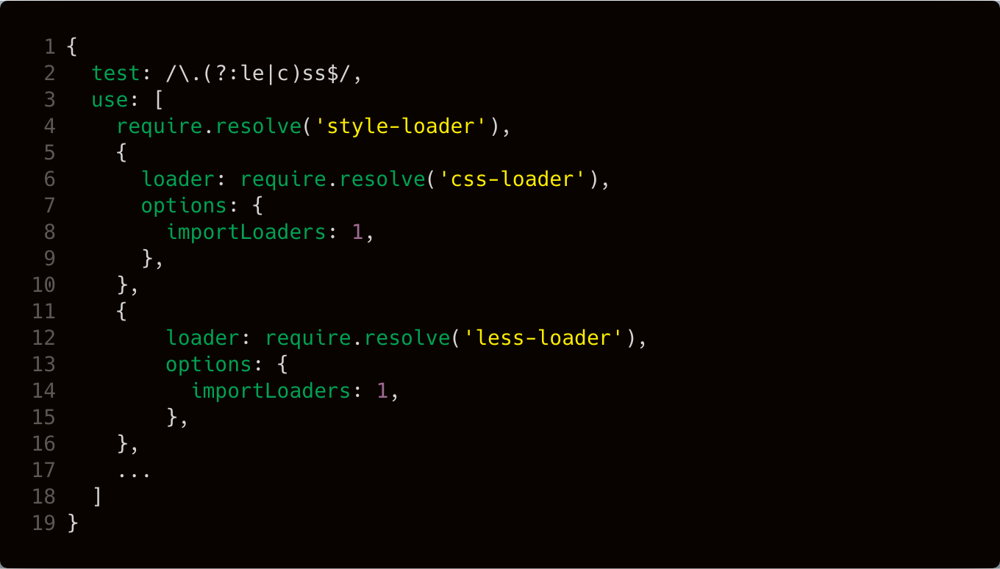

# Wait For You Website
An official website for *Wait For You*.

### How to use LESS
1. Find `/node_modules/react-scripts/config/webpack.config.dev.js`;
2. Find `test: /\.css$/`, change it to `test: /\.(?:le|c)ss$/`;
3. On the `use` array, after the `css-loader` object, add:
    ```javascript
    {
        loader: require.resolve('less-loader'),
        options: {
            importLoaders: 1,
        },
    }
    ```
    Before this, run `npm i --save-dev less-loader less-watch-compiler`;
4. Your file should like this:
    
5. Apply the same setting to `/node_modules/react-scripts/config/webpack.config.prod.js`.

**Reference**
1. [**Create React App**](https://github.com/facebook/create-react-app)
2. [*Structuring projects and naming components in React*](https://hackernoon.com/structuring-projects-and-naming-components-in-react-1261b6e18d76)
3. [*Adding SASS or LESS support to create-react-app*](https://medium.com/@giordano.cardillo/adding-sass-or-less-support-to-create-react-app-38cbe6c370ce)